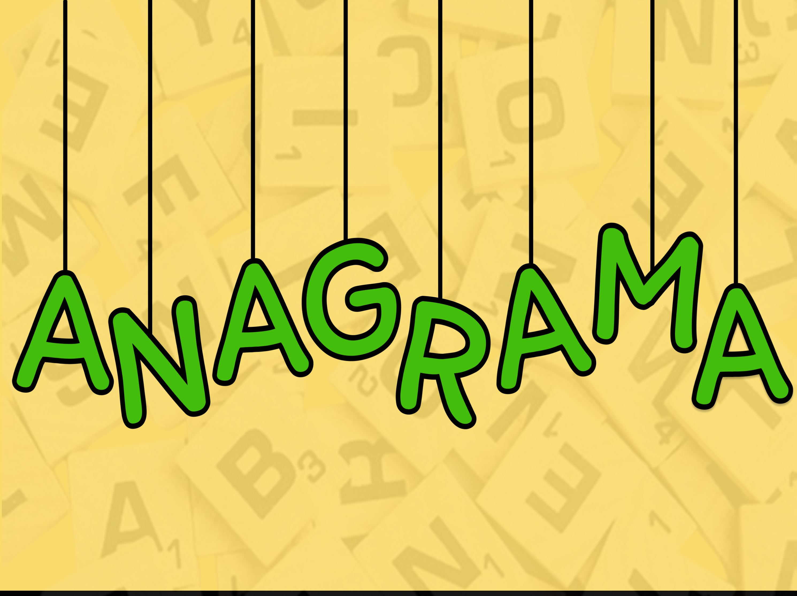

<table style="width: 100%;">
  <tr>
    <td style="vertical-align: middle; padding-right: 10px;">
      <h1 style="margin: 0;">SDLC</h1>
    </td>
    <td style="vertical-align: middle; text-align: right;">
      
    </td>
  </tr>
</table>

## Ciclo de vida de desenvolvimento de software

## **1. Planejamento**

1. Apresentação do projeto Brinque & Aprenda.

2. Quadro de competências e habilidades.

- 

3. Divisão de equipes e definição de papéis.

- **_Equipe 0_**

  - Neemias de Melo Vasconcelos – Programador geral
  - Marco Antonio Bomfim Cardoso Dantas – Designer geral
  - Gustavo de Sá Teles Mendes – Programador geral
  - Cesar Nogueira - Programador geral
  - Matheus Santos - Gestor geral 

- **_Equipe 1_**

  - Everton Oliveira – Programador
  - Pablo de Souza – Programador
  - Joedson Nascimento – Design
  - Maria Núbia Avelino – Design
  - Hernandes Pereira – Gestão

- **_Equipe 2_**

  - Daniel Joaquim – Gestor
  - Gabriel Bispo – Programador
  - Eduardo de Jesus – Programador
  - Gustavo Henrique – Designer

- **_Equipe 3_** 

  - Emanuel Vítor Ramos dos Santos Gonzaga – Designer
  - Vítor Thadeu Martins da Silva Gonzaga – Programador
  - Thiago Sampaio Santiago Pereira – Programador
  - Gustavo Ramon Ribeiro Oliveira Santos  – Gestor
  - Rafael da Conceição Cunha – Designer

- **_Equipe 4_**

  - Jadson Rodrigo Santos Pereira – Gestão
  - Emanuel Gomes Bispo – Programador
  - Silas Pereira de Souza Dantas – designer
  - Joabe Borges da Silva – Gestão
  - Felipe Dantas Ferreira – designer

4. Definição dos documentos do projeto (atas, documento do projeto, documento do jogo).

5. Utilização do Git para versionamento do código e do GitHub para publicação (projeto open source).

6. Utilização do Kanban com o Trello.

7. Elaboração do cronograma.

## **2. Análise**

1. Compreensão do projeto.

2. Pesquisa de 5 jogos possíveis por cada equipe.

3. Escolha dos jogos a serem desenvolvidos.
- *Abacomania é um jogo educativo voltado principalmente para desenvolver habilidades matemáticas básicas, como adição, subtração, multiplicação e divisão, de forma lúdica e interativa.*

  

 - *Anagrama é um jogo de palavras que tem como objetivo formar novas palavras rearranjando as letras de uma palavra original.*

    

- *Digirance é um jogo educativo que trabalha o reconhecimento de letras e o desenvolvimento da escrita. Seu objetivo principal é ajudar na alfabetização, principalmente de crianças.*

  

- *Jornada dos brichos é um jogo educativo que tem como foco principal ensinar sobre meio ambiente, biodiversidade e preservação da natureza, geralmente por meio da interação com personagens de animais.*

  

## **3. Design**

1. Criação das telas no Figma (imagem do Figma)

2. Definição dos backgrounds.

3. Definição dos assets.

4. Criação de todas as imagens com IA.

## **4. Desenvolvimento**

1. Organização do GitHub e configuração do Git

2. Criação do template-base para os jogos

3. Implementação da lógica dos jogos

4. Desenvolvimento completo dos jogos

## **5. Testes**

1. Criação do formulário de teste (explicação do formulário de teste)

2. Teste de cada jogo pelos alunos

3. Preenchimento dos formulários

4. Análise do feedback (print dos gráficos)

## **5. Entrega**

1. Registro do domínio [www.brinqueaprenda.com.br](www.brinqueaprenda.com.br)

2. Publicação do projeto no domínio

3. Entrega das documentações finais

4. Registro do software

