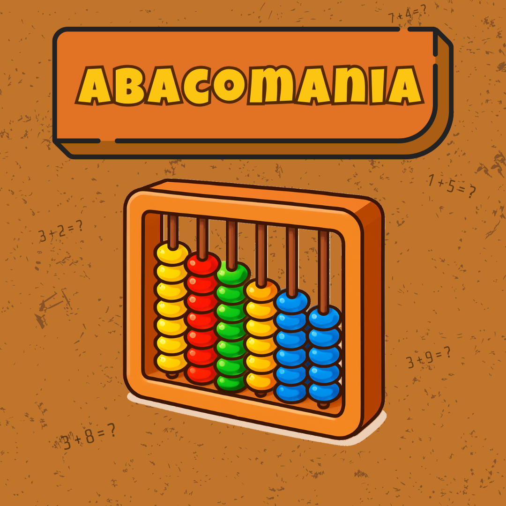

<table style="width: 100%;">
  <tr>
    <td style="vertical-align: middle; padding-right: 10px;">
      <h1 style="margin: 0;">SDLC</h1>
    </td>
    <td style="vertical-align: middle; text-align: right;">
      
    </td>
  </tr>
</table>

## 1 Planejamento

1. Apresentação do projeto Brinque & Aprenda

2. Quadro de competências e habilidades

- 

3. Divisão de equipes e definição de papéis

4. Definição dos documentos do projeto (atas, documento do projeto, documento do jogo)

5. Utilização do Git para versionamento do código e do GitHub para publicação (projeto open source)

6. Utilização do Kanban com o Trello

7. Elaboração do cronograma

## 2 Análise

1. Compreensão do projeto

2. Pesquisa de 5 jogos possíveis por cada equipe

3. Escolha dos jogos a serem desenvolvidos (imagem)
- Abacomania

 

 - Anagrama.

- Digirance 

- jornada dos brichos 

## 3 Design

1. Criação das telas no Figma (imagem do Figma)

2. Definição dos backgrounds

3. Definição dos assets

4. Criação de todas as imagens com IA

## 4 Desenvolvimento

1. Organização do GitHub e configuração do Git

2. Criação do template-base para os jogos

3. Implementação da lógica dos jogos

4. Desenvolvimento completo dos jogos

## 5 Testes

1. Criação do formulário de teste (explicação do formulário de teste)

2. Teste de cada jogo pelos alunos

3. Preenchimento dos formulários

4. Análise do feedback (print dos gráficos)

## 5 Entrega

1. Registro do domínio www.brinqueaprenda.com.br

2. Publicação do projeto no domínio

3. Entrega das documentações finais

4. Registro do software

