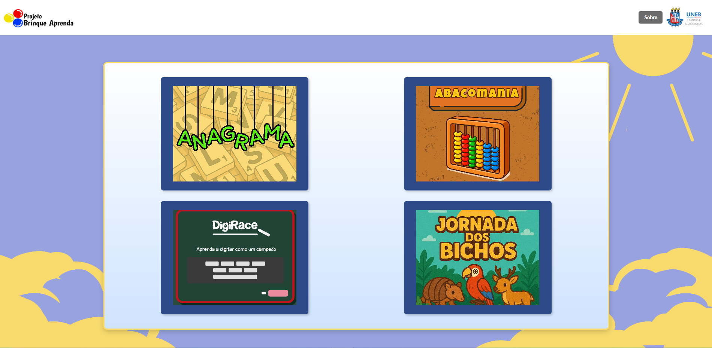
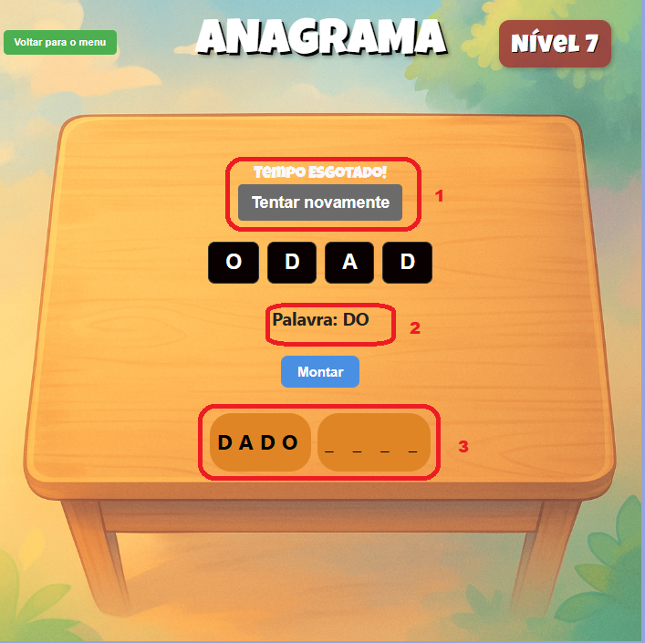

<table style="width: 100%;">
  <tr>
    <td style="vertical-align: middle; padding-right: 10px;">
      <h1 style="margin: 0;">Documento do Projeto</h1>
    </td>
    <td style="vertical-align: middle; text-align: right;">
      
    </td>
  </tr>
</table>

## **Projeto brinque  aprenda.**

## Equipe 0

- Neemias – Função - programador 
- Marco Antonio – Função - designer 
- Gustavo D'Sa – Função - programador 
- Cesar Nogueira - Função - programador
- Matheus Santos- Função - gestor

## Equipe 1

- Everton Oliveira – Programador
- Pablo de Souza – Programador
- Joedson Nascimento – Design
- Maria Núbia Avelino – Design
- Hernandes Pereira – Gestão

## Equipe 2

- Daniel Joaquim – Gestor
- Augusto Rabelo – Programador
- Gabriel Bispo – Programador
- Eduardo de Jesus – Programador
- Gustavo Henrique – Designer

## Equipe 3 

- Emanuel Vítor – Função - Designer
- Vítor Thadeu – Função - Programador
- Thiago Sampaio – Função - Programador
- Gustavo Ramon – Função - Gestor
- Rafael – Função - Designer

## Equipe 4

- Jadson Rodrigo – Gestão
- Emanuel Gomes – Programador
- Silas Pereira – designer
- Joabe Borges – Gestão
- Felipe Dantas – designer

## Descrição.

Brinque Aprenda é um projeto educacional interativo voltado para crianças em idade pré-escolar e nos primeiros anos do ensino fundamental. A plataforma combina jogos educativos, atividades lúdicas e conteúdos pedagógicos com o objetivo de tornar o aprendizado mais divertido, envolvente e eficaz.

## Objetivo.

O objetivo do projeto Brinque Aprenda é desenvolver uma plataforma digital interativa que auxilie no processo de ensino-aprendizagem de crianças, utilizando jogos e atividades lúdicas como ferramentas pedagógicas.

## Público Alvo.

O projeto é voltado a crianças do ensino fundamental.

## Imagens geral dos jogos.

## Manual do Jogo **_Ábacomania_**

1. O jogo será iniciado ao clicar no botao " JOGAR ".
2. Uma tela de níveis será disponibilizada para seleção, com uma dificuldade pré definida.
3. O usuário precisa calcular a partir das peças disponíveis e arrastar os discos para a haste conforme o número pedido.
4. Os discos tem valor a partir da onde são colocados. Cada haste tem um valor específico indicado pela sua letra.Os discos tem valor a partir da onde são colocados. Cada haste tem um valor específico indicado pela sua letra.
    - A letra U representa unidades. conta-se de 1 em 1.
    - A letra D representa dezenas. conta-se de 10 em 10.
    - A letra C representa centenas. conta-se de 100 em 100.
5. Após o número atingir o resultado pedido, um botão acenderá para ser clicado e passar para a próxima fase com um novo número, cada vez mais difícil.

## Manual do jogo **_Anagrama_** 

1. Para acessar o jogo "Anagrama" clique no primeiro jogo do menu de jogos da pagina inicial do site conforme indica a imagem a seguir:

2. Esta é a tela principal do jogo onde os elementos circulados são descritos da seguinte forma:

    - Retorno ao menu de jogos - Botão para retornar para o menu de jogos na pagina inicial;
    - Nível do jogo - Indica em que nivel o jogador se encontra;
    - Cronometro - O jogador possui tempo limitado para encontrar as palavras necessárias para completar o nível;
    - Letras - As letras necessarias para formar as palavras escondidas, ao selecionar uma letra ela será indicada no campo "Palavra";
    - Campo palavra - Neste campo as letra selecionadas pelo jogador irão aparecer na sequencia que foram selecionadas, sendo limitada pela quantidade de letras da maior palavra escondida;
    - Botão montar - Após inserir as letras necessarias para formar uma palavra, o jogador irá apertar o botão para verificar se a palavra montada é uma das palavras escondidas;
    - Campo de palavras - As palavras escondidas encontradas ficarão armazenadas neste campo;
3. Alguns eventos do jogo:

   - Cronometro zerado - Após o tempo se esgotar a mensagem: "Tempo esgotado!" e o botão "Tentar novamente";
   - Representação das letras selecionadas;
   - Palavra encontrada - ao acertar uma das palavras escondidas, a palavra ficará armazenada neste campo; 

## Manual do jogo **_Digirance._**

1. Acesse o jogo por meio do navegador
2. Clique em Digirance para Iniciar.
3. Escolha o modo de dificuldade:
    - Fácil: palavras simples e tempo maior.
    - Médio: palavras moderadas e tempo reduzido.
    - Difícil: palavras complexas e tempo curto.
4. Digite corretamente as palavras que aparecem na tela.
5. O sistema mostra um feedback para cada palavra:
    - “Correto!” para palavras digitadas corretamente.
    - “Errou” para palavras erradas ou não digitadas a tempo.
6. Ao final do tempo, é exibido um resumo com pontuação, acertos e erros.
7. O jogador pode reiniciar o jogo e tentar melhorar seu desempenho.

## Manual do jogo **_Jornada dos bichos._**

1. 

## Micro Atividades.

- Anagrama
- Jornada dos bichos
- Ábacomania
- Digirance

## Cronograma.

| Etapa                 | Período                   | Status       |
|-----------------------|---------------------------|------------  |
| Desenvolvimento       | Durante um semestre       | Em andamento |
| do Software           |                           |              |
|                       |                           |              |